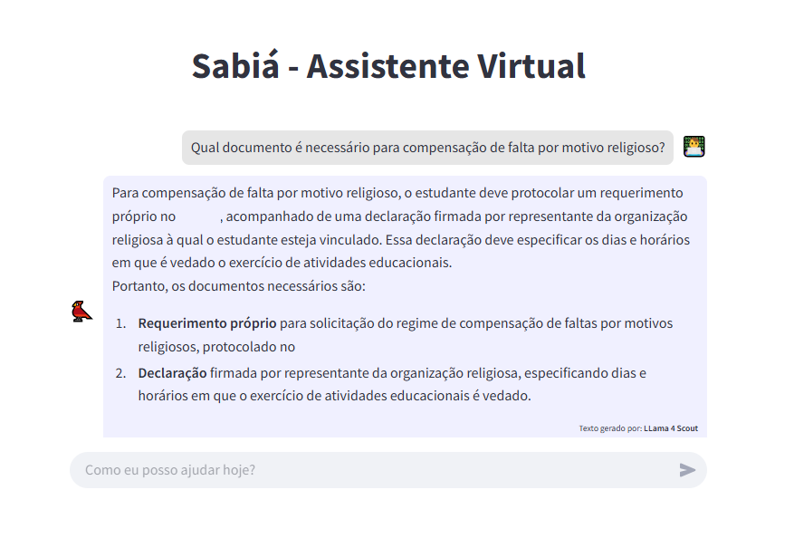
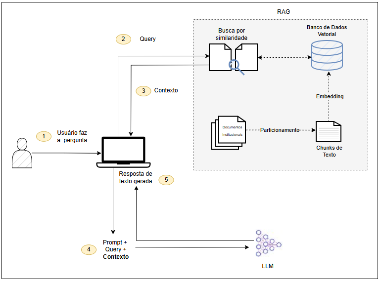

# 🐦 Sabiá – Assistente Virtual Universitário

No dia a dia acadêmico, informações importantes costumam estar espalhadas por diferentes documentos, regulamentos, sistemas e sites institucionais. Isso pode dificultar o acesso e a compreensão para estudantes, professores e agentes administrativos, especialmente quando há prazos, dúvidas urgentes ou processos pouco intuitivos.

O Sabiá foi criado para resolver esse problema: um assistente virtual que centraliza o conhecimento institucional de forma clara, acessível e inteligente. Seu nome foi escolhido por remeter ideias como leveza, clareza e comunicação — qualidades ideais para um chatbot no ambiente acadêmico. O Sabiá oferece respostas rápidas e confiáveis, promovendo uma experiência mais fluida, eficiente e acolhedora para toda a comunidade universitária.

**Este projeto foi feito com ❤️ por e para a comunidade acadêmica.**

---

## 🌱 Por que “Sabiá”?


O **sabiá** é uma ave amplamente admirada no Paraná, associada à beleza, liberdade e à conexão com a natureza. Seu canto inspira sensibilidade e tradição, sendo frequentemente presente na cultura popular e na memória afetiva dos paranaenses. Escolher o nome “Sabiá” para este projeto é uma forma de homenagear esse símbolo regional, reforçando os laços entre inovação tecnológica e identidade cultural. **O objetivo do Sabiá é promover o conhecimento de forma acessível para toda a comunidade acadêmica.**

---


_**#ParaTodosVerem:** A imagem consiste na tela da aplicação Sabiá, que consiste na interface dessa aplicação. Na parte superior tem um título "Sabiá - Assistente Virtual". Mais abaixo, tem um exemplo de interação entre o usuário e o chatbot. Alinhado à direita, tem a pergunta do usuário com um emoji de um estudante no computador. Alinhado à esquerda, tem a resposta do chatbot com um emoji que representa um pássaro. Também tem um placeholder no final da resposta que indica o modelo de LLM que gerou a resposta. Mais abaixo, tem um campo para o usuário digitar sua pergunta e interagir com a aplicação, com um placeholder "Como eu posso ajudar hoje?"_


## 🚀 Sobre o Projeto

Este projeto foi criado para ser:

✅ **Fácil de implementar**  
🎨 **Personalizável**  
🏫 **Adaptável a qualquer universidade ou instituição**

Você pode:

- Personalizar o comportamento do assistente
- Adaptar o visual da interface
- Treinar o modelo com documentos institucionais da sua escolha

> ✨ Ideal para qualquer instituição que deseje seu próprio assistente acadêmico com IA!

---

## ⚙️ Tecnologias Utilizadas

- 🐍 **Python 3.9**
- 🖥️ **Streamlit** — Interface web interativa
- 🧠 **OpenRouter** — Acesso a múltiplos LLMs
- 🧩 **ChromaDB** — Armazenamento vetorial
- 🔍 **OpenAI Embeddings**
- 🔧 **LangChain**

---

## 📁 Estrutura do Projeto

```
📂 projeto-sabia/
│
├── 📁 __pycache__/           
├── 📁 .vscode/               
├── 📁 db/                    
├── 📁 pdfs/                  
├── 📁 venv/                  
│
├── app.py                   
├── config.py                
├── ingest.py                
├── prompt.py                
├── rag.py                   
├── requirements.txt         
├── README.md                
```

---

## 🛠️ Como Rodar Localmente

### 1️⃣ Clone o repositório:

```bash
git clone https://github.com/usuario/sabia.git
cd sabia
git checkout -b minha-versao-sabia
```

### 2️⃣ Crie e ative o ambiente virtual:

> 💡 **Por que criar um ambiente virtual?**  
> Esse passo é opcional, mas altamente recomendado. Um ambiente virtual isola as dependências do seu projeto, evitando conflitos com pacotes instalados globalmente no sistema. Isso facilita a manutenção, o compartilhamento do projeto com outras pessoas e evita erros inesperados ao trabalhar com múltiplos projetos Python.

```python
python -m venv venv
# Ativando no Windows:
.venv\Scripts\activate
# Ativando no macOS/Linux:
source venv/bin/activate
```

### 3️⃣ Instale as dependências:

```bash
pip install -r requirements.txt
```

### 4️⃣ Configure suas chaves:

Crie o arquivo `config.py` com este conteúdo:

```python
OPENROUTER_API_KEY = "sua-chave-openrouter-aqui"
OPENAI_API_KEY = "sua-chave-openai-aqui"
```

> 🔐 Ambas as chaves são opcionais, dependendo do modelo e embeddings que você quiser usar.

### 5️⃣ Inicie o aplicativo:

```bash
streamlit run app.py
```

---

## 🧠 Treinando o Modelo com Seus Documentos

1. Coloque seus **regulamentos, manuais e documentos institucionais** na pasta `/pdfs`
2. O script `ingest.py` é rodado automaticamente quando a aplicação é executada, criando assim os embeddings com base nesses documentos.

---

## 🔍 Arquitetura da Aplicação

### 🧩 Como Funciona:

1. O usuário envia uma pergunta pela interface.
2. A pergunta é enviada para o **RAG** (Retrieval-Augmented Generation).
3. O RAG consulta um **banco de dados vetorial** com documentos institucionais previamente particionados em trechos (chunks) e convertidos em embeddings.
4. Após a busca por similaridade, o RAG retorna o **contexto relevante**.
5. Esse contexto é combinado com a pergunta do usuário, formando um **prompt enriquecido**.
6. O prompt é enviado para o modelo LLM (como GPT-4, Gemini 2.0 Flash, etc.) que gera a resposta final.
7. A resposta é devolvida para o usuário pela interface.



> _**#ParaTodosVerem:** Diagrama da arquitetura da aplicação. À esquerda, há um ícone de usuário enviando uma pergunta para a aplicação (representada por um computador). Uma seta liga a aplicação a uma área destacada com fundo cinza pontilhado que representa o processo RAG (Retrieval-Augmented Generation). Dentro dessa área, há um ícone de lupa sobre documentos representando a busca por similaridade. Essa lupa está conectada por uma seta ao banco de dados vetorial, representado por um cilindro, que por sua vez recebe uma seta vinda de ícones de "chunks" de texto convertidos em embeddings — originados a partir de documentos institucionais. Após a busca por similaridade, uma seta retorna do ícone de busca para a aplicação, com o contexto recuperado pelo RAG. Outra seta parte da aplicação rumo a um ícone que representa o LLM carregando a pergunta do usuário enriquecida com o contexto recuperado. Por fim, uma nova seta traz a resposta gerada pelo LLM de volta para a aplicação, que exibe a resposta ao usuário._

---

## 🎨 Personalização

### Interface – `app.py`
Você pode personalizar:
- Nome da página (`st.set_page_config`)
- Ícones e cores
- Títulos, mensagens e placeholders

### Comportamento da IA – `prompt.py`
Altere o template para definir:
- Tom de voz (formal, casual, divertido...)
- Persona (ex: professor, colega de classe, bot neutro...)

### Geração de respostas – `rag.py`

O arquivo `rag.py` é responsável por gerar a resposta da IA utilizando a técnica de RAG (Retrieval-Augmented Generation). O fluxo geral é:

```python
context = db.similarity_search_with_relevance_scores(user_query, k=3)
context = list(filter(lambda x: x[1] >= 0.5, context))
```

Você pode:
- Alterar o número de documentos considerados (`k`)
- Ajustar a pontuação mínima de relevância (`0.5`)
- Trocar o modelo LLM utilizado

---

## 🔐 Autenticação

### OpenRouter
- Gere uma chave em: https://openrouter.ai

### OpenAI
- Gere uma chave em: https://platform.openai.com

Coloque suas chaves no arquivo `config.py`.

---

## 🤝 Contribuindo

Achou útil? Quer adaptar para sua instituição?  
**Fique à vontade!** Basta criar um fork, modificar o que quiser e voar com o Sabiá 🐤

---

## 📬 Contato

Dúvidas, ideias ou sugestões?  
Abra uma *issue* ou envie uma mensagem pelo GitHub.

---
